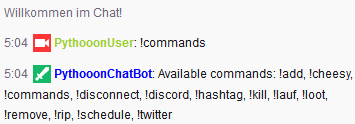

# twitch-chat-bot-js
> A simple Chat Bot for a single Twitch Channel.

## Features
- Easy configuration using JSON files
- Users in chat can create custom commands
- Users in chat can set custom hashtag

## Installation
1. Create configuration file `app.cfg.json` based on `app.cfg.example.json` contents and **adjust based on your needs**
1. Create command database file `commands.json` based on `commands.example.json` contents for your default commands. In addition all user commands will be saved here
1. Create hashtag file `hashtag.json` based on `hashtag.example.json` contents
1. Install dependencies using `$ npm install`
1. Run Chat Bot using `$ node app.js`
1. Stop Chat Bot by using keyboard interrupt `Ctrl+C`

## Build-in Commands
- `!add`
- `!remove`
- `!commands`
- `!hashtag`
